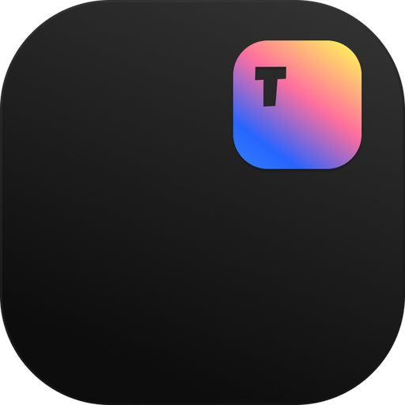

# Typeset

<p align="center">
  
</p>

Typeset is an open-source, Windows-first native Markdown workspace built with Tauri v2, Rust, Next.js, TypeScript, Tailwind, and shadcn/ui.

It is designed for fast local note work: browse Markdown files from a sidebar, create folders and sub-notes, edit source Markdown, preview rich Markdown, open external `.md` files from Windows, and maintain deterministic `LAYOUT.md` indexes that agents can read quickly.

## Status

- Version: `1.0.3`
- License: MIT
- Primary platform: Windows
- Repository: <https://github.com/EthanRodrigues001/Typeset>

## Downloads

For Windows, use the latest GitHub release: <https://github.com/EthanRodrigues001/Typeset/releases/latest>.

- `Typeset_1.0.3_x64-setup.exe`: recommended installer for most users.
- `Typeset_1.0.3_x64_en-US.msi`: MSI installer for Windows deployment workflows.

Because v1 artifacts are currently unsigned, Windows Smart App Control may warn or block installation on strict systems. Signed installers are recommended for broad public distribution.

## Updates

Typeset `1.0.1` is the first updater-enabled baseline. If you installed `1.0.0`, install `1.0.1` manually from GitHub Releases once. After that, future releases such as `1.0.2+` can be checked and installed from inside Typeset.

The app checks GitHub Releases once per launch. When an update is available, Typeset shows an Update button next to Settings in the sidebar and an Updates section in Settings with version details, release notes, download progress, and install confirmation.

Release updates are powered by the Tauri v2 updater plugin and signed updater metadata. GitHub Releases hosts `latest.json`, installer artifacts, and `.sig` files.

## Highlights

- Native desktop shell with Tauri v2.
- In-app update checks and install flow for updater-enabled releases.
- Static-exported Next.js app bundled inside the desktop build.
- Dark shadcn/ui interface with sidebar, overview, editor, preview, and split modes.
- Managed Markdown workspace stored in a `.typeset` folder.
- Folder and note creation, rename, move, delete, drag/drop moves, and folder colors.
- Sub-note model using normal files and folders.
- CodeMirror Markdown source editor with undo, redo, save commands, and a floating command dock.
- Markdown preview with GitHub Flavored Markdown, task lists, tables, code blocks, safe HTML, images, and Mermaid diagrams.
- Fullscreen dialogs for images and Mermaid diagrams.
- External `.md` open support from Windows Explorer.
- Deterministic `LAYOUT.md` files in every folder for agent-friendly indexing.
- Context graph tab that indexes workspace `README.md` files and generated layout metadata.
- Generated root `CONTEXT.md` graph index for fast agent and developer discovery.
- First-run `Getting Started/Getting Started.md` note for new workspaces.

## Screens And Main Areas

Typeset has three primary surfaces:

- **Overview:** storage totals, recent notes, largest folders, and all managed Markdown files.
- **Sidebar:** search, settings, recent files, folders, notes, sub-notes, drag/drop moves, and folder color choices.
- **Editor:** Preview, Source, and Split modes with a compact document toolbar.

## Workspace Model

On first launch, Typeset creates a managed workspace:

```text
Documents/.typeset
```

The workspace location can be changed from Settings. For safety, Typeset currently allows `.typeset` workspaces inside Documents, Desktop, or Downloads.

An empty or new workspace is seeded with:

```text
Getting Started/
  Getting Started.md
```

That starter note explains the app from inside the app and gives users a safe note to edit.

## Notes And Sub-Notes

All managed notes are normal `.md` files.

```text
Topic.md
Topic/Child.md
Topic/Child/Grandchild.md
```

`Topic.md` is a parent note. A sub-note under it is stored inside the same-name companion folder, `Topic/`.

When a note is renamed, moved, or deleted, Typeset also handles its same-name child folder.

## Agent-Friendly Layout Indexes

Typeset writes a generated `LAYOUT.md` file in every folder. These files are hidden from normal note editing and regenerated after create, save, rename, move, delete, import, or sync actions.

Each `LAYOUT.md` contains:

- deterministic frontmatter
- a machine-readable JSON block between `TYPESET_INDEX_BEGIN` and `TYPESET_INDEX_END`
- a readable Markdown tree
- note metadata such as headings, tags, links, updated time, and byte size

Agents can inspect the workspace by reading folder-level indexes before walking every file.

## Context Graph Index

Typeset also writes a generated root `CONTEXT.md` file. It is hidden from normal note editing and regenerated from workspace `README.md` files plus `LAYOUT.md` metadata.

`CONTEXT.md` contains:

- deterministic frontmatter
- a machine-readable JSON graph block between `TYPESET_CONTEXT_BEGIN` and `TYPESET_CONTEXT_END`
- a readable outline of README context
- graph nodes for workspace, folders, README files, notes, headings, tags, and links

The Context tab visualizes that file as a local 2D graph so people and agents can find project context without indexing every note body. Existing workspaces get `CONTEXT.md` automatically on startup or sync.

## External Markdown Files

The packaged Windows app registers Typeset as an opener for `.md` files. From Explorer:

```text
Right click a .md file -> Open with -> Typeset
```

External files opened from anywhere on the PC are shown in Recent, but they are not shown in the Folders tree and are not indexed into the managed workspace.

Use Import inside Typeset when you want to copy an external Markdown file into `.typeset`.

## Markdown Support

Typeset preview supports:

- headings
- paragraphs and line breaks
- bold, italic, strikethrough, inline code
- ordered and unordered lists
- task lists
- blockquotes
- callouts
- links and internal `.md` links
- images
- tables
- fenced code blocks
- Mermaid diagrams
- footnotes
- safe inline HTML through the configured sanitizer

## Tech Stack

- **Desktop:** Tauri v2
- **Native backend:** Rust
- **Frontend:** Next.js static export, React, TypeScript
- **UI:** shadcn/ui, Tailwind, Lucide icons
- **Editor:** CodeMirror 6
- **Markdown:** react-markdown, remark-gfm, rehype-sanitize, rehype-highlight
- **Diagrams:** Mermaid
- **Packaging:** Tauri bundle targets

## Requirements

- Windows 10 or Windows 11
- Node.js compatible with Next.js 16
- Rust toolchain compatible with Tauri v2
- WebView2 Runtime on Windows

## Development Setup

Install dependencies:

```powershell
npm install
```

Run the web frontend only:

```powershell
npm run dev
```

Run the Tauri desktop app:

```powershell
npm run tauri -- dev
```

Build the static frontend:

```powershell
npm run build
```

Build the desktop bundle:

```powershell
npm run tauri -- build
```

Build a signed updater-capable Windows release locally:

```powershell
$env:TAURI_SIGNING_PRIVATE_KEY_PATH="C:\Users\Ethan Rodrigues\.typeset-updater\typeset.key"
npm run tauri -- build
```

For CI releases, store the private updater key as the GitHub Actions secret `TAURI_SIGNING_PRIVATE_KEY_B64`.

```powershell
$key = [Convert]::ToBase64String([IO.File]::ReadAllBytes("$env:USERPROFILE\.typeset-updater\typeset.key"))
gh secret set TAURI_SIGNING_PRIVATE_KEY_B64 --repo EthanRodrigues001/Typeset --body $key
```

If you regenerate the key with a password, also set `TAURI_SIGNING_PRIVATE_KEY_PASSWORD`.

Run Rust checks:

```powershell
cd src-tauri
cargo check
cargo test
```

## Project Structure

```text
src/
  app/                 Next.js app routes and global styles
  components/          Typeset UI, Markdown preview, shadcn/ui components
  lib/                 Frontend IPC wrapper and utilities
src-tauri/
  src/lib.rs           Rust commands, workspace model, layout indexing
  tauri.conf.json      Tauri app, bundle, icon, updater, and file association config
public/
  markdown-test/       Static Markdown syntax test assets
.github/
  workflows/           Windows release workflow with updater artifacts
  ISSUE_TEMPLATE/      Bug and feature request templates
```

## Safety Rules

- Only `.md` notes are managed.
- `LAYOUT.md` is generated and cannot be edited as a normal note.
- Unsafe Windows names, reserved names, duplicates ignoring case, and path traversal are rejected.
- Rust owns filesystem operations through typed Tauri IPC.
- External files remain external until imported.
- Workspace location changes are validated and limited to allowed user folders.

## Windows Smart App Control

Unsigned local development builds may be blocked by Windows Smart App Control. This does not mean the code is malware. It means Windows cannot verify the publisher for the unsigned dev executable or generated build artifacts.

For contributors, use a development machine or VM where unsigned local builds are allowed. For public release distribution, signed Windows artifacts are recommended.

## Contributing

Contributions are welcome. Start with [CONTRIBUTING.md](CONTRIBUTING.md).

Good first contributions include:

- Markdown rendering fixes
- accessibility improvements
- Windows installer and signing improvements
- documentation
- tests for Rust path validation and layout indexing
- UI polish that follows the existing dark desktop style

Before opening a pull request:

```powershell
npm run lint
npm run build
cd src-tauri
cargo check
cargo test
```

## Security

Please do not open public issues for security-sensitive reports. See [SECURITY.md](SECURITY.md).

## Changelog

See [CHANGELOG.md](CHANGELOG.md).

## License

Typeset is released under the [MIT License](LICENSE).
