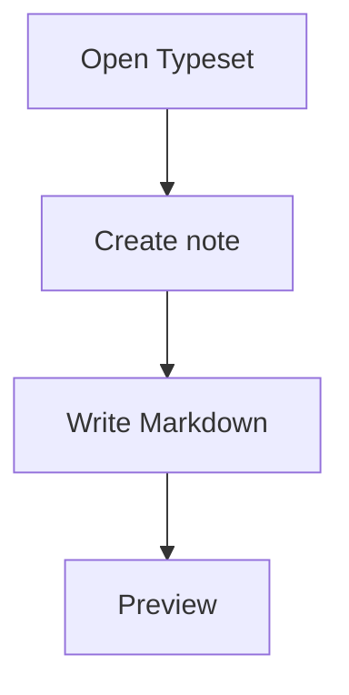

# Kitchen Sink

This file covers common Markdown, CommonMark, and GitHub Flavored Markdown syntax for preview testing.

Use these tags for index extraction: #markdown #typeset/test #alpha-beta

## Headings

# H1 Example

## H2 Example

### H3 Example

#### H4 Example

##### H5 Example

###### H6 Example

## Paragraphs And Line Breaks

This is a normal paragraph with enough text to wrap across several lines in the preview pane. It should remain readable and keep normal paragraph spacing.

This line ends with two spaces.  
This should be a hard line break.

This line
breaks softly
in the source.

## Emphasis

This sentence has *italic text*, **bold text**, ***bold italic text***, _underscore italic_, __underscore bold__, and ~~strikethrough~~.

Nested emphasis: **bold with *italic inside*** and *italic with **bold inside***.

Literal characters: \*not italic\*, \_not italic\_, \# not a heading.

## Inline Code

Use `npm run build`, `cargo test`, and `C:\Users\Ethan\Documents\.typeset`.

Backticks inside inline code: ``Use `code` inside code``.

## Links

Inline link: [Typeset local note](Project.md).

Relative nested link: [Child note](Project/Child-Note.md).

Reference link: [CommonMark reference][commonmark].

Autolink: <https://commonmark.org>

Bare URL: https://example.com/docs/readme.md

[commonmark]: https://commonmark.org/help/

## Images

Inline image with missing local asset:


Remote image reference:


## Lists

Unordered list:

- Alpha
- Beta
  - Beta one
  - Beta two
    - Beta two child
- Gamma

Ordered list:

1. First
2. Second
3. Third
   1. Third child one
   2. Third child two

Mixed list:

1. Plan
   - Read
   - Build
   - Verify
2. Ship

Loose list:

- Item with paragraph.

  Second paragraph under the same item.

- Another item.

## Task Lists

- [x] Render Markdown preview
- [x] Save source edits
- [ ] Test Windows file association
- [ ] Import external note

Nested tasks:

- [ ] Parent task
  - [x] Child task done
  - [ ] Child task pending

## Blockquotes

> A simple blockquote.

> A blockquote with multiple lines.
>
> - A list inside the quote
> - Another item
>
> `inline code` inside quote

Nested quote:

> First level
>
> > Second level
> >
> > > Third level

## Horizontal Rules

---

***

___

## Tables

| Feature | Status | Notes |
| --- | ---: | :--- |
| Preview | Done | Right aligned status column |
| Source | Done | Left aligned notes column |
| Import | Pending | External file flow |

Escaped pipes:

| Value | Meaning |
| --- | --- |
| `a \| b` | Pipe inside inline code |
| one \| two | Escaped pipe text |

## Code Blocks

Indented code:

    const value = "indented";
    console.log(value);

Fenced JavaScript:

```js
function greet(name) {
  return `Hello, ${name}`;
}

console.log(greet("Typeset"));
```

Fenced TypeScript:

```ts
type Note = {
  path: string;
  content: string;
};

const note: Note = {
  path: "Topic.md",
  content: "# Topic",
};
```

Fenced Rust:

```rust
#[tauri::command]
fn read_note(path: String) -> Result<String, String> {
    Ok(path)
}
```

Unknown language:

```madeup
this should still render as a code block
```

## HTML

Inline HTML: <span title="test">span text</span>

Details block:

<details>
<summary>Click me</summary>

Hidden detail text.

</details>

Unsafe script should not execute:

<script>alert("do not run")</script>

## Footnotes

Here is a footnote reference.[^one]

Here is another footnote reference.[^long-note]

[^one]: Short footnote.

[^long-note]: A longer footnote with **bold**, `code`, and a [link](https://example.com).

## Definition Lists As Plain Markdown

Term
: Definition text

Another term
: Another definition

## Math As Plain Text

Inline math-like text: `$E = mc^2$`

Block math-like text:

```math
\int_0^1 x^2 dx = \frac{1}{3}
```

## Mermaid As Code



## Backslash Escapes

\! \# \$ \% \& \( \) \* \+ \- \. \/ \: \< \= \> \? \@ \[ \\ \] \^ \_ \` \{ \| \} \~

## Long Line

This is a deliberately long line used to verify wrapping behavior in preview and source views. It includes words, punctuation, inline `code`, a [link](https://example.com/very/long/path/to/a/markdown/file.md), and enough content to stretch across the editor area without breaking the layout or causing horizontal overflow in normal preview text.

## Final Section

End of kitchen sink.
