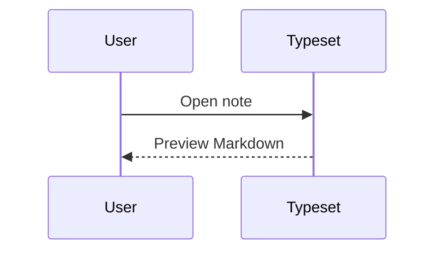

# Code Blocks

## Inline Code

Use `npm run tauri -- dev` for development.

Use ``code with `backticks` inside`` for nested backticks.

## JavaScript

```js
const notes = ["Topic.md", "Project.md"];
console.log(notes.map((note) => note.toLowerCase()));
```

## TypeScript TSX

```tsx
type Props = {
  title: string;
};

export function Title({ title }: Props) {
  return <h1>{title}</h1>;
}
```

## Rust

```rust
use serde::Serialize;

#[derive(Serialize)]
struct Note {
    path: String,
}
```

## JSON

```json
{
  "version": 1,
  "entries": [
    {
      "kind": "note",
      "path": "Project.md"
    }
  ]
}
```

## PowerShell

```powershell
$env:CARGO_TARGET_DIR="C:\tmp\typeset-tauri-target"
npm run tauri -- dev
```

## Diff

```diff
- old line
+ new line
```

## Mermaid Stored As Code


